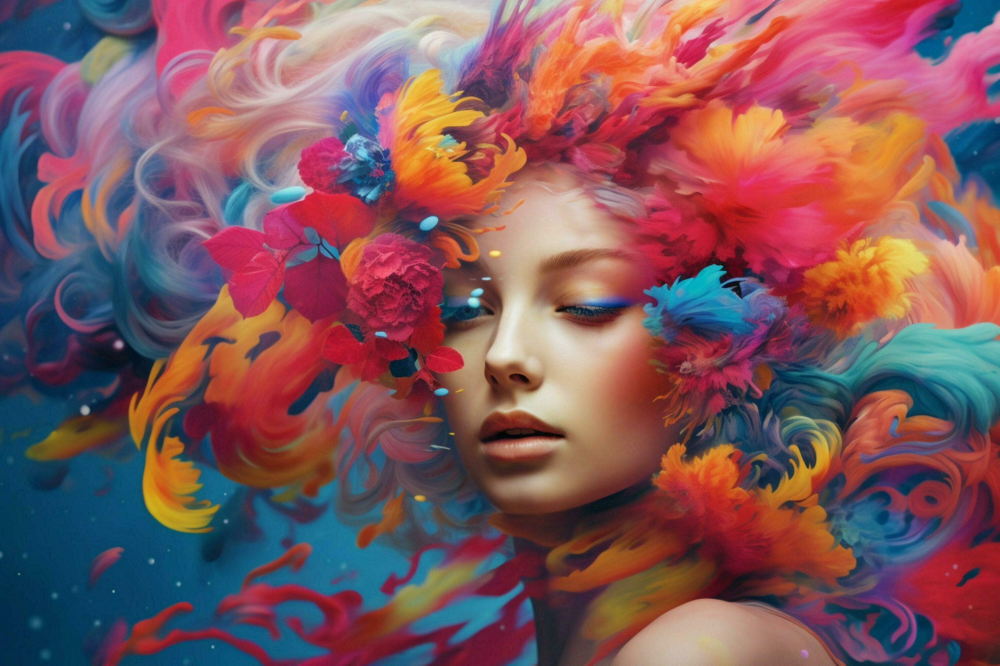

# Machine-Vision
# Machine Vision – Week 1 Assignment

**Name:** Sabiha binte Nizam
**Course:** Machine Vision  
**Date:** 2026-01-22  
**Git Hub link** = https://github.com/sabiha906030/Machine-Vision/tree/main/Machine_vision_as_1

## Overview

This repository contains my solutions for **Machine Vision – Week 1**, which focuses on basic image processing using **OpenCV** and **Python**.  
The assignment is divided into two main parts:

- **Task A:** OpenCV basics and RGB channel visualization  
- **Task B:** Manual annotation of objects in a RoboDK camera snapshot  

## Task A – OpenCV Basics

### Description

In Task A, I worked with a color image and explored how OpenCV handles RGB channels.

Steps performed:
1. Loaded a colorful image from disk
2. Converted the image from BGR to RGB
3. Split the image into **Red**, **Green**, and **Blue** channels
4. Displayed the original image and the three channels in a 2×2 grid using `matplotlib`
5. Added my name to the title of the original image
6. Saved the final grid as an image file

### Result

## Task B – RoboDK Snapshot Annotation

### Description

In Task B, I manually annotated objects visible in a RoboDK camera snapshot.  
The goal was **not automatic detection**, but **accurate manual marking using pixel coordinates**.

Annotated objects:
- Box
- Cube
- Sphere
- Cylinder

### My Approach

Instead of guessing coordinates, I used a **mouse-click coordinate tool** to get exact pixel values from the image.  
This allowed me to place shapes accurately over each object.

Different shapes were used based on the object geometry:
- **Rectangles** → Box and Cube
- **Circle** → Sphere
- **Rectangle (not circle)** → Cylinder (because it is horizontal)

Each object was labeled clearly, and the final annotated image was saved and displayed.

**Result**

---

## Problems I Faced and How I Solved Them

### 1. Wrong object shape for the cylinder  
Initially, I marked the cylinder using a circle, which only covered one end of the object.

**Solution:**  
I realized the cylinder is a horizontal object, so I replaced the circle with a **rectangle**, which correctly represents its shape.

---

### 2. Incorrect object positioning  
Some annotations were slightly misaligned at first.

**Solution:**  
I used a custom script to click on the image and read exact `(x, y)` coordinates from the terminal.  
By adjusting only the top-left and bottom-right points, I was able to fix the alignment precisely.

## Performance and Speed

- The scripts execute almost instantly
- Manual annotation is fast once correct coordinates are known

